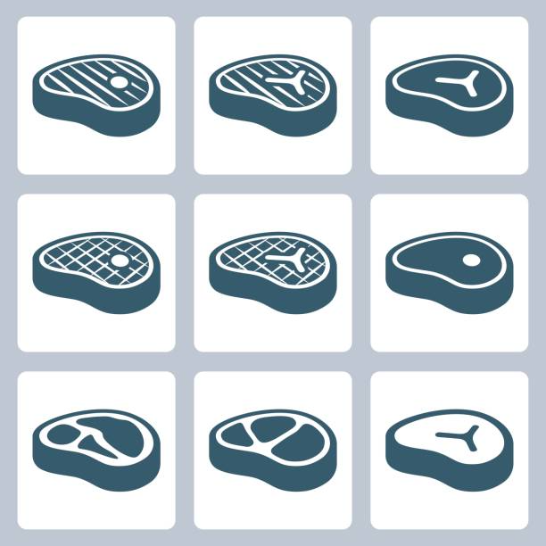

[繁](./README_ZH.md) ｜ [简](./README_SC.md) ｜ EN

Originality:
&nbsp

&nbsp
Innovation:
&nbsp

&nbsp
Challenge:
&nbsp

🛠️ <a href="#operation-principles">Operation Principles</a>
｜
📁 <a href="#file-structure">File Structure</a>
｜
🖥️ <a href="#usage-instructions">Usage Instructions</a>
｜
👀 <a href="#example-results">Example Results</a>

📣 <a href="#common-errors">Common Errors</a>
｜
🙋🏻‍♂️ <a href="#frequently-asked-questions">Frequently Asked Questions</a>

### This repository is not ready

# Modular Evolution of Aumenting Topology

MEAT (Modularly Enhanced Augmenting Topology) is an evolutionary algorithm that extends NEAT by incorporating modular structures instead of individual nodes and edges. This approach accelerates neural network evolution, making it more adaptable to complex tasks such as stock trading. By dynamically growing network topology in a structured and scalable manner, MEANT enables more efficient learning and decision-making in evolving environments.